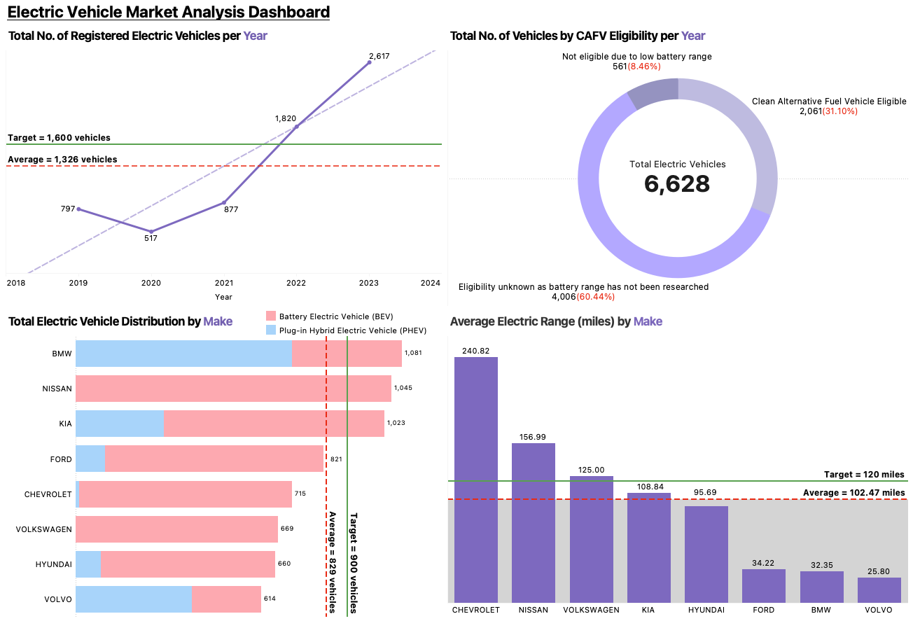
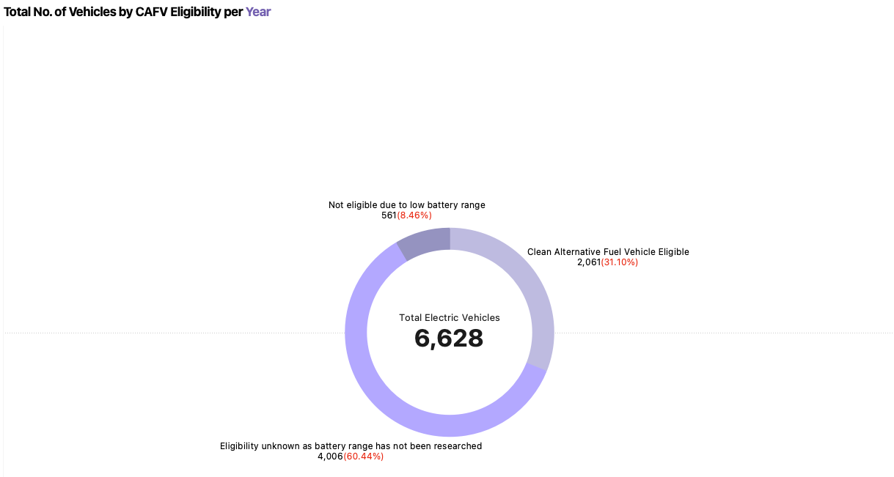
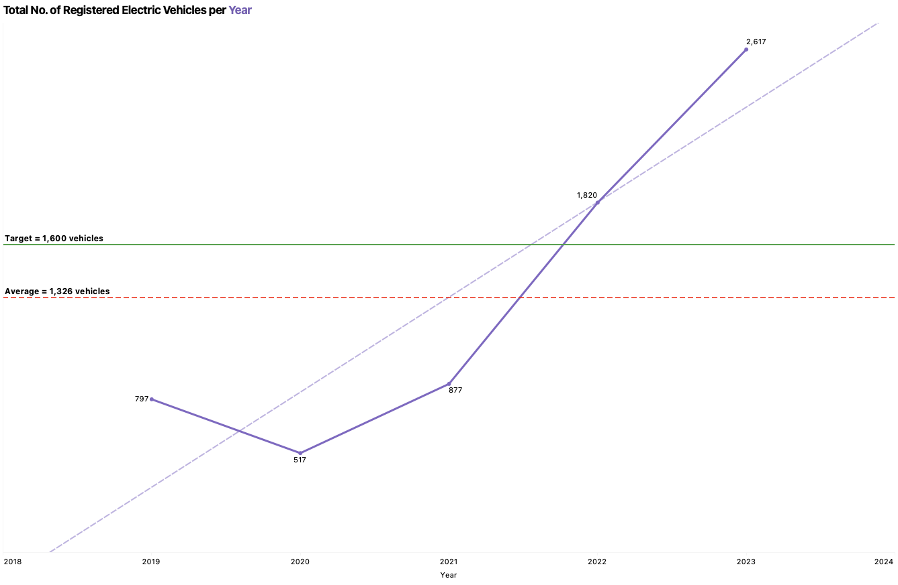
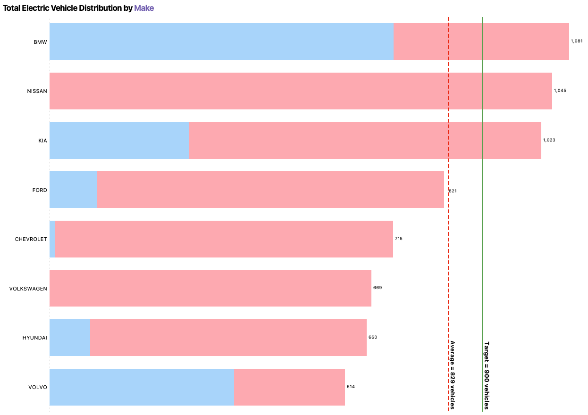
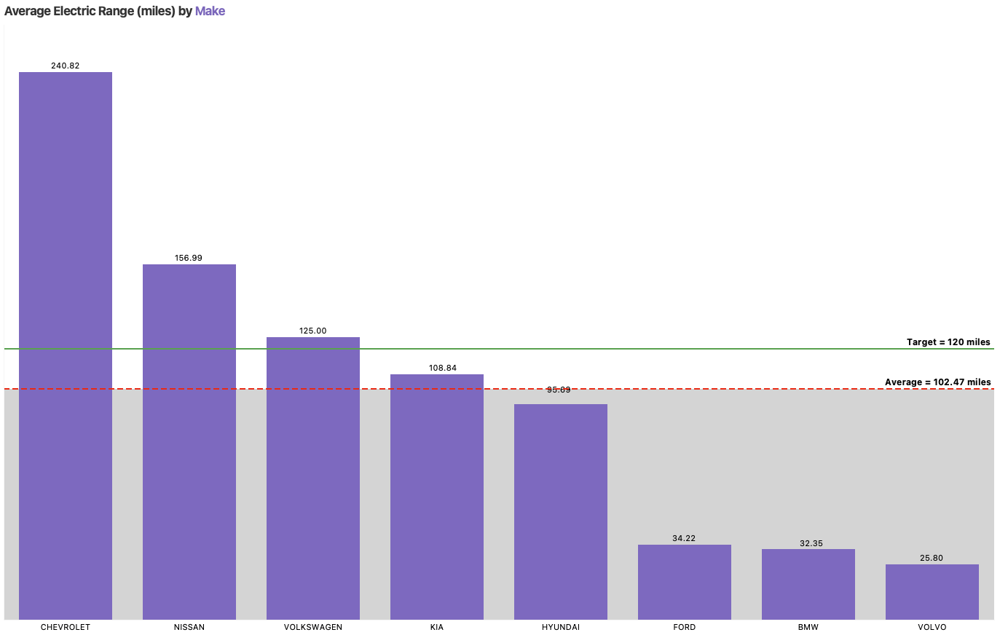

# 🚗🔋 Electric Vehicle Market Analysis: Data Visualisation with Tableau

This study analyses **6,628 electric vehicle (EV) records** from Washington State to uncover market trends, brand performance, and infrastructure insights. It demonstrates data cleaning, chart design with reference lines and parameters, and dashboard development using **Tableau**.

---

## 🏷️ Business Context

As EV adoption accelerates, understanding registration trends, CAFV eligibility, and range performance across manufacturers helps policymakers and industry stakeholders make informed decisions. The goal is to identify key patterns in the EV market and present them through an interactive, insight-driven dashboard.

---

## 🗂️ Dataset

This study uses the Electric Vehicle Population Data (USA) dataset containing **6,633 raw records across 11 variables**, covering vehicle identification, geographic data, manufacturer details, EV type, CAFV eligibility, and electric range.

- **Raw Records**: 6,633
- **Cleaned Records**: 6,628 (after treating missing values, spelling errors, negative postal codes, and decimal legislative districts)
- **Variables**: 11 (1 interval, 1 ratio, 9 nominal)
- **Source**: Electric Vehicle Population Data (USA)

---

## 📋 Executive Summary

- **CAFV Eligibility**: 60.44% of EVs have unknown CAFV status; 31.10% are eligible, indicating room for policy-driven improvement
- **Registration Trend**: EV registrations have risen steadily since 2020, with a target of 1,600 average annual registrations set as a benchmark
- **Top Manufacturer**: BMW has the highest number of EVs; Chevrolet leads in average electric range at 240.82 miles, well above the overall average of 102.47 miles
- **EV Type**: Battery Electric Vehicles (BEV) dominate the market across most manufacturers

> **Business Takeaway**: Focus EV infrastructure investment on high-registration regions and manufacturers exceeding the 120-mile range target. Address the CAFV data gap to improve policy targeting.

---

## ⚙️ Tools Used

- **Data Cleaning**: Microsoft Excel
- **Visualisation and Dashboard**: Tableau (reference lines, parameters, actions)

---

## 🗃️ Project Structure

- `data/` — Raw EV dataset (.csv)
- `tableau/` — Tableau workbook (.twbx)
- `visuals/` — Screenshots of individual charts, dashboard, and action settings

---

## 📈 Dashboard

### Full Dashboard

---

### Donut Chart: CAFV Eligibility Distribution

> 60.44% of EVs have unknown CAFV eligibility status. 31.10% are eligible, with a Year filter allowing users to track eligibility trends over time.

### Line Chart: Yearly Registered Electric Vehicles

> EV registrations show a consistent upward trend since 2020. A reference line for average registrations and a parameter for BEV/PHEV/Both filtering enable dynamic exploration. Target set at 1,600 average annual EVs.

### Stacked Bar Chart: EV Distribution by Manufacturer

> BMW leads in total EV count. A reference line highlights above and below-average manufacturers, with a target parameter of 900 vehicles for growth benchmarking.

### Bar Chart: Average Electric Range by Manufacturer

> Chevrolet leads with 240.82 miles average range. A reference line distinguishes above-average manufacturers; target set at 120 miles as the desired minimum range.

---

## 🔍 Analytics Approach

**Data Cleaning**
- Removed 5 records with missing Vehicle Identification Numbers (0.08% of dataset)
- Corrected 2 spelling errors in the City field ("Redmon" to "Redmond")
- Fixed 2 negative values in the Postal Code field
- Rounded 2 decimal values in the Legislative District field to nearest whole number
- Imputed 1 outlier in Electric Range (800 miles replaced with 259 miles based on matching vehicle records)

**Dashboard Design**
- Applied 7 dashboard design principles: simplicity, minimal clutter, single-page fit, limited colour palette, priority zone placement, formatted numbers, and descriptive chart titles
- Action 1: URL action on the Electric Range chart linking to an external explanation page, triggered via Menu function to prevent accidental navigation
- Action 2: Highlight action on the EV Manufacturer Distribution chart using hover to cross-highlight related data points across charts

---

## 🎯 Key Results

| Metric | Value |
|---|---|
| Total EVs (cleaned) | 6,628 |
| CAFV-eligible vehicles | 31.10% |
| Top manufacturer by count | BMW |
| Highest avg electric range | Chevrolet (240.82 miles) |
| Overall avg electric range | 102.47 miles |

---

## 🚫 Limitations

- Dataset is limited to Washington State and may not reflect national EV trends
- 60.44% of CAFV eligibility statuses are unknown, limiting policy analysis
- Electric range data contains a high proportion of zero values, skewing the median and mode
